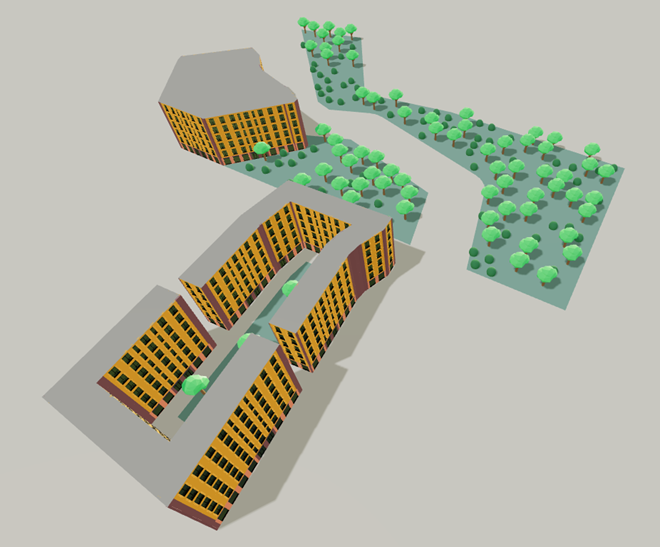

# Web PCG

Разработка метода процедурной генерации для игровых веб-приложений 
с учётом особенностей отображения трёхмерной графики в браузере.

Презентация доступна по [ссылке](./docs/presentation.pptx).

## Как запустить

1. Клонируйте репозиторий.

2. Установите зависимости.
```bash
npm ci
```

3. Рекомендуется запускать в режиме разработки.
```bash
npm run dev
```

## Метод

Комплексный метод, включает в себя генерацию с использованием грамматики для регулярных
объектов из блоков (как здания) и процедурную расстановку объектов (как деревья) с применением
модифицированного алгоритма коллапса волновой функции.


## Файловая структура

``` bash
├─── src/
│   ├─── grammar/ # генерация блоков с помощью грамматик
│   ├─── pages/ # страницы с примерами и тестами
│   ├─── random/ # генератор рандомных чисел
│   └─── wfc/ # wave function collapse
```

Представленные страницы c примерами, в большинстве своём, являются прототипами. Для продуктового использования их, возможно, придётся переработать.

В папках `grammar/` и `wfc/` находятся реализации используемых алгоритмов.

## Примеры



